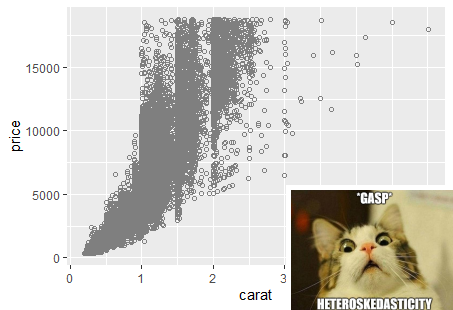

```{r setup, include=FALSE}
knitr::opts_chunk$set(echo = FALSE)
knitr::opts_chunk$set(fig.width=9, fig.height=5) 

library(dplyr)
library(ggplot2)
library(lfe)
library(stargazer)
library(robustbase)
library(wooldridge)
library(magick)
library(lm.beta)
```

## Odds and Ends

- Regression Interpretation

  - Binairy Dependent Variables

- Non-Standard Standard Errors
    
- Confidence intervals for predictions
    
- Spatial Data


# Regression Interpretation and Variable Transformations


## Regression Interpretation 

You must be able to interpret a regression correctly.

3 elements you want to touch upon (the three S'):

1) **Sign**- is the coefficient you are discussing positive or negative? Does the sign of the coefficient match your priors or is it surprising?

2) **Size**- What is the magnitude of the coefficient? Is the effect of $x$ on $y$ economically meaningful or not? Make your interpretation informative to your audience,by being precise.

3) **Significance**- Is the estimate statistically significant? Can we reject that the true coefficient is equal to zero? With what confidence level?

## Regression Interpretation 

While it is not incorrect to say the that a one unit increase in $x$ leads to a $\beta$ unit change in $y$, you will generally want to be more precise:

- specify the units of measurement
    
- interpret the coefficients appropriately: 
    
  - if the regression used a logged variable, a binairy dependent variable, a standardized variable... 
        
  - it may be useful to scale the values into more intuitive units. 

- If the regression features a polynomial discuss the difference in the magnitude of the marginal effects at different key values. 
        
- If the regression features interaction terms, interpret the implications for different types of observations
    
- it is often useful to compare the coefficient to the mean and sd of the dependent variable  to gauge magnitudes
    
  

## Regression Interpretation 

- Scaling

- Standardizing

- Regressions in Logs

- Quadratics

- Interactions with Continuous Variables

- Binairy Dependent variables

  - Linear probability Models
  
  - Logits

# Scaling

## Scaling

Units of measurement in the data are not always intuitive. 

Suppose I am interested in the following regression: 
$$
sleep=\beta_0+\beta_1totwork+\beta_2educ+u
$$
Using the `sleep75` data that is part of the `wooldrige` package:

\tiny
```{r scal, echo=TRUE}
regsleep1<-lm(sleep~totwrk+educ, sleep75)
summary(regsleep1)
```


## Scaling

What do these coefficients mean? 

You need to know the units of measurement for each of the variables:

- $educ$ is measured in years of education

- $sleep$ and $totwrk$ are measured in minutes per week. 

**one additional year of education is associated with 13.5 fewer minutes of sleep per week**.

$\Rightarrow$ probably not the most intuitive interpretation

## Scaling the dependent variable

One way, adjustment in interpretation: $13.5$ min per week $=\frac{13.5}{60}=0.23\approx 1/4$ hour per week. 

Rewrite interpretations in terms of hours by dividing the old coefficients by 60:
$$
\frac{\hat{\beta}_0}{60};\frac{\hat{\beta}_1}{60};\frac{\hat{\beta}_2}{60}. 
$$

## Scaling the dependent variable

Alternatively, run the regression after having scaled our $sleep$ variable in terms of hours:
\tiny
```{r scal2, echo=TRUE}
sleep75$sleephrs<-sleep75$sleep/60

regsleep2<-lm(sleephrs~totwrk+educ, sleep75)
summary(regsleep2)
```

## Scaling the dependent variable

If we re-scale the dependent variable $y$ by a constant $c$, then the equation we estimate becomes

$$
\begin{aligned}
\tilde{y}&=\tilde{\beta}_0+\tilde{\beta}_1x_1+...+\tilde{\beta}_kx_k+u\\
cy&=c\beta_0+c\beta_1x_1+c\beta_2x2+...+c\beta_kx_k+u.
\end{aligned}
$$
In the example above, $c=\frac{1}{60}$, so the new $\hat{\beta}$'s will be divided by 60 too.

Nothing else about the regression changes ($R^2$, t-stats, p-values). 


## Scaling the independent variable

1 minute increase in total work per week predicts a decrease in sleep of 0.0025 hours per week. 

$\Rightarrow$ one hour increase in total work predicts a 60*(0.0025)=0.15 hour decrease in sleep per week.

Scale the variable in R prior to running the regression:
\tiny
```{r scal3, echo=TRUE}
sleep75$totwrkhrs<-sleep75$totwrk/60

regsleep3<-lm(sleephrs~totwrkhrs+educ, sleep75)
summary(regsleep3)
```


## Scaling the independent variable

The other coefficients will be unchanged.

The coefficient on the scaled variable will adjust accordingly.

In general, if we scale $x$ by $c$, the equation becomes:

$$
\begin{aligned}
y&= \beta_0+\tilde{\beta}_1\tilde{x}_1+...+\beta_kx_k+u\\
&= \beta_0+\frac{\tilde{\beta}_1}{c}(c\tilde{x}_1)+...+\beta_kx_k+u.
\end{aligned}
$$

# Standardizing

## Standardizing

Standardizing variables eliminates the units:

- makes it possible to compare the magnitude of estimates across independent variables. 

- makes interpretation easier if you have variables with weird arbitrary units that are unfamiliar to people.  

## Standardizing

Suppose we have a regression with two variables, $x_1$ and $x_2$:

$$
y=\hat{\beta}_0+\hat{\beta}_1 x_1 +\hat{\beta}_2x_2+\hat{u}
$$

A linear regression must go through the point of averages:

- if we plugged in $\bar{x}_1$ and $\bar{x}_2$, we would predict $\bar{y}$:

$$
\bar{y}=\hat{\beta}_0+\hat{\beta}_1\bar{x}_1 +\hat{\beta}_2\bar{x}_2
$$

## Standardizing

We can subtract the second equation from the first to get:
$$
\begin{aligned}
\hat{y}-\bar{y}&=(\hat{\beta}_0+\hat{\beta}_1 x_1 +\hat{\beta}_2
x_2+\hat{u})-(\hat{\beta}_0+\hat{\beta}_1\bar{x}_1 +\hat{\beta}_2\bar{x}_2)\\
&=\hat{\beta}_1( x_1-\bar{x}_1) +\hat{\beta}_2(
x_2-\bar{x}_2)+\hat{u}
\end{aligned}
$$
Dividing both sides of this equation by the standard deviation of $y$, $\sigma_y$ and multiplying each independent variable by $1=\frac{\sigma_x}{\sigma_x}$, we can get the regression into standard units: 

$$
(\frac{y-\bar{y}}{\hat{\sigma}_y})=\frac{\hat{\sigma}_{x_1}}{\hat{\sigma}_y}\hat{\beta}_1(\frac{x_1-\bar{x}_1}{\hat{\sigma}_{x_1}})+\frac{\hat{\sigma}_{x_2}}{\hat{\sigma}_y}\hat{\beta}_2(\frac{x_2-\bar{x}_2}{\hat{\sigma}_{x_2}})+\frac{\hat{u}}{\hat{\sigma}_y}
$$

## Standardizing

Controlling for $x_2$ a **one standard deviation** increase in $x_1$ leads to a $\frac{\hat{\sigma}_{x_1}}{\hat{\sigma}_y}\hat{\beta}_1$ **standard deviation** increase in the predicted $y$. 

This is the standardized coefficient or "beta" coefficient.


It is also possible to only standardize some variables ( you will need an intercept in this case).


## Standardizing

In R, we can get these coefficients by using the `scale()` command in `R`.  

We use the bwght2 dataset to look at how parent ages correlate with birth weights. (Note: birth weights here will be measured in grams). 

I estimate four different regressions of the type 
$$
birthweight_i=\beta_0+\beta_1 motherage_i+\beta_2 fatherage_i+\epsilon_i
$$

scaling either the dependent and/or independent variables.

## Standardizing
\tiny
```{r scaling, echo=TRUE, results="asis"}


reg1<-lm(bwght~mage+fage, bwght2)
reg2<-lm(scale(bwght)~scale(mage)+scale(fage), bwght2)
reg3<-lm(scale(bwght)~mage+fage, bwght2)
reg4<-lm(bwght~scale(mage)+scale(fage), bwght2)

meandep1<-round(mean(bwght2$bwght),2)
meandep2<-round(mean(scale(bwght2$bwght)),2)
sddep1<-round(sd(bwght2$bwght),2)
sddep2<-round(sd(scale(bwght2$bwght)),2)
```


## Standardizing
\tiny
```{r scalinga, echo=TRUE, results="asis"}

stargazer(reg1,reg2, reg3, reg4, type = "latex" , header=FALSE,omit.stat = "all",
          add.lines=list(c("Mean",meandep1,meandep2, meandep2, meandep1 ),
                         c("SD",sddep1,sddep2, sddep2, sddep1 )))

```


## Standardizing
\tiny
Interpreting column 1:

- A mother that is **a year** older predicts a birthweight that is 3.992 **grams** less (not significant).

- A father that is **a year** older predicts a birthweight that is 9.313 **grams** more (significant).

Interpreting column 2:

- A mother whose age is **one standard deviation higher** predicts a birthweight that is 0.033 **standard deviations** lower (not significant).

- A father whose age is **one standard deviation higher** predicts a birthweight that is 0.092 **standard deviations** higher (significant).

Interpreting column 3:

- A mother that is **a year** older predicts a birthweight that is 0.007 **standard deviations** lower (not significant).

- A father that is **a year** older predict a birthweight that is 0.016 **standard deviations** higher (significant).

Interpreting column 4:

- A mother whose age is **one standard deviation higher** predicts a birthweight that is 19.044 **grams** lower (not significant).

- A father whose age is **one standard deviation higher** predicts a birthweight that is 53.205 **grams** higher (significant).


# Logs

## Logs


Using log's to transform a variable can greatly improve the fit of your model. 

When you do this, you need to then adjust your interpretation accordingly:

- Linear functions and unit-unit changes

- Logarithmic functions and percent-unit changes

- Exponential functions and Unit-Percent changes

- Log-Log functions and Percent-Percent changes (eg elasticities)

## Linear functions and unit-unit changes


If we assume a linear functional form, the model is: 
$$
y=\beta_0+\beta_1x.
$$ 

**Interpretation**:Take the derivative of the expression to get: 
$$
\frac{dy}{dx}=\beta_1.
$$

Rewrite as:
$$
\frac{\Delta y}{\Delta x}=\frac{dy}{dx}=\beta_1.
$$
Rearranging:
$$
\Delta y= \beta_1 \Delta x.
$$
Suppose $\Delta x=1$, so that $x$ changes by 1 **unit**. Plugging into the above expression we see that $y$ will change by $\beta_1$ **units**.


## Logarithmic functions and percent-unit changes

\bigskip

If we assume a logarithmic functional form, the model is: 
$$
y=\beta_0+\beta_1 log(x).
$$
**Interpretation:** First take the derivative of our model (recall: if $w=log(v)$ then $\frac{dw}{dv}=\frac{1}{v}$). Thus for our model: 
$$
\frac{dy}{dx}=\frac{\beta_1}{x}
$$ 
For small changes in $x$ this can be approximately rewritten as:
$$
\begin{aligned}
\frac{\Delta y}{\Delta x}\approx \frac{dy}{dx}&=\frac{\beta_1}{x}\\
\Rightarrow \Delta y&= \beta_1 \frac{ \Delta x}{x}.
\end{aligned}
$$
If $x$ changes by 10 **percent**, the proportional change in $x$ is 0.1 $\Rightarrow \frac{\Delta x}{x}=0.1$. Plugging into the expression above we see that $y$ will change by $\beta_1*0.1$ **units**. 

## Exponential functions and Unit-Percent changes\

With an exponential functional form, the model is: $y=e^{\beta_0+\beta_1x}$ or 
$$
log(y)=\beta_0+\beta_1x.
$$
**Interpretation:** Taking the derivative wrt to $x$: $\frac{dlog(y)}{dx}=\beta_1.$ For small changes we can rewrite this as 
$$
\frac{\Delta log(y)}{\Delta x}\approx \frac{dlog(y)}{dx}=\beta_1.
$$
Using the fact that $\Delta log(y)=\frac{\Delta y}{y}$:$\Rightarrow \frac{\frac{\Delta y}{y}}{\Delta x}\approx \frac{dlog(y)}{dx}=\beta_1,$
we can rearrange and see that 
$$
\frac{\Delta y}{y}=\beta_1\Delta x \Rightarrow \underbrace{\frac{\Delta y}{y}\times100}_{\text{percent change}}=(\beta_1 \Delta x)\times100
$$
Suppose $x$ changes by 1  **unit**. The proportional change in $y$ is $\beta_1$ and the percent change in $y$ is $100\times\beta_1$ **percent**. 

## Log-Log functions and \%-\% changes (eg elasticities)\ 


If we assume a log-log functional form, the model is 
$$
log(y)=\beta_0+\beta_1log(x).
$$
**Interpretation:** The derivative of our model is $\frac{dlog(y)}{dx}=\beta_1\frac{1}{x}$. Re-writing it in terms of small changes we get:
$$
\begin{aligned}
\frac{\Delta log(y)}{\Delta x}\approx \frac{dlog(y)}{dx}&=\beta_1(\frac{1}{x})\\
\Rightarrow \Delta log(y)&=\beta_1 (\frac{\Delta x}{x})\\
\Rightarrow \frac{\Delta y}{y}&=\beta_1  (\frac{\Delta x}{x})\\
\Rightarrow \frac{\Delta y}{y}\times100&=\beta_1  (\frac{\Delta x}{x})\times 100
\end{aligned}
$$
Suppose we know that $x$ changes by 1 **percent**. Plug the value into this expression and we see that $y$ will change by $\beta_1$ **percent**. 


## Summary:\


|Model      |DepVar| IndepVar |How does $\Delta y$ relate to $\Delta x$? |Interpretation       |
|--------------|--------|----------|----------------|---------------------|
|Linear     | y    |x         |$\Delta y=\beta_1\Delta x$                | $\Delta y=\beta_1 \Delta x$ |
|Logarithmic| y |log(x) |$\Delta y=\beta_1\frac{\Delta x}{x}$| $\Delta y=\beta_1 \frac{\% \Delta x}{100}$ |
|Exponential| log(y) |x |$\frac{\Delta y}{y}=\beta_1\Delta x$| $\% \Delta y=\beta_1 \Delta x \times 100$ |
|Log-log    | log(y) |log(x)|$\frac{\Delta y}{y}=\beta_1\frac{\Delta x}{x}$| $\% \Delta y=\beta_1 \%\Delta x$ |


## Practice:\

**Example 1:** You have data on gas consumption and prices, you estimate the following model

$$
log(gas)=12-0.21price
$$
**How does gas consumption change when price increases by 1 dollar?**

$\Rightarrow$ Top Hat

## Practice:\

**Example 1:** You have data on gas consumption and prices, you estimate the following model

$$
log(gas)=12-0.21price
$$
**How does gas consumption change when price increases by 1 dollar?**
$$
\frac{\Delta y}{y}=\beta_1\Delta x \Rightarrow \frac{\Delta y}{y}=(-0.21)\times 1= -0.21\Rightarrow \%\Delta y=-21\%
$$

## Practice:

**Example 2:**
You have data on corn and beef prices, you estimate the following model

$$
log(P_{beef})=0.83+0.491log(P_{corn})
$$
**How does $P_{beef}$ change is $P_{corn}$ rises by 2\%?**

$\Rightarrow$ Top Hat


## Practice:

**Example 2:**
You have data on corn and beef prices, you estimate the following model

$$
log(P_{beef})=0.83+0.491log(P_{corn})
$$
**How does $P_{beef}$ change is $P_{corn}$ rises by 2\%?**

$$
\frac{\Delta y}{y}=\beta_1\frac{\Delta x}{x}=0.49\times0.02= 0.00982\Rightarrow +0.982\%
$$


## Practice:

**Example 3:** You have data on CEO salaries (in hundred thousand dollars) and annual firm sales (millions of dollars). You estimate:

$$
salary=2.23+1.1log(sales)
$$
**How does salary change if annual sales increase by 10\%?**

$\Rightarrow$ Top Hat


## Practice:

**Example 3:** You have data on CEO salaries (in hundred thousand dollars) and annual firm sales (millions of dollars). You estimate:

$$
salary=2.23+1.1log(sales)
$$
**How does salary change if annual sales increase by 10\%?**
$$
\Delta y=\beta_1\frac{\Delta x}{x}=1.1\times0.1=0.11
$$
If sales increase by 10\%, CEO salaries are predicted to increase by 0.11 (hundred thousand)= 11,000 dollars.


# Quadratics

## Quadratics


When interpreting a variable that includes a quadratic (or higher order) polynomial, the marginal effect of the variable are not linear.

Suppose we are interested in the relationship between age and sleep:
$$
sleep=\beta_0+\beta_1 age+\beta_2 age^2+u
$$


This model allows for the marginal effect of age on sleep to change, along a quadratic functional form. 

To see this, take the derivative of sleep with respect to age:
$$
\frac{dsleep}{dage}=\beta_1+2*\beta_2*age.
$$

## Quadratics

$$
\frac{dsleep}{dage}=\beta_1+2*\beta_2*age.
$$

The predicted effect of age on sleep depends on an observations age.  

When interpreting, the marginal effect:

- specify the age at which you are interpreting at,

- give a sense of the marginal effects at different key points of the age distribution. 

## Quadratics

Retrieving the coefficients, we get:

\tiny
```{r quad, echo=TRUE}
sleep75$age2<-sleep75$age*sleep75$age
regquad<-lm(sleep~age+age2, sleep75)

summary(regquad)
```
\normalsize
thus 
$$
\frac{dsleep}{dage}=-21.5+0.6*age.
$$

## Quadratics

$$
\frac{dsleep}{dage}=-21.5+0.6*age.
$$


If you are 22 years old, our model predicts that a year from now you will be getting 8.3 fewer minutes per week of sleep than now.

If you are currently 60, our model predicts that a year from now you will be getting 14.5 more minutes per week of sleep than now.

Age is predicted to decrease sleep until a person is 35.8 years old, then an additional year is associated with an increase in sleep (where $\frac{dsleep}{dage}=0$).

It is common to interpret non-constant marginal effects at the mean or median value of the explanatory variable, or at any value that would be of particular interest to your audience. 

# Interactions with continuous variables


## Interactions with continuous variables


When interpreting interactions with continuous variables,  the marginal effect of the variable are not linear. Include this in your interpretations.


Suppose we are interested in the relationship between age, education and sleep:
$$
sleep=\beta_0+\beta_1 age+\beta_2 educ+\beta_3 age \times educ+u
$$

This model allows for the marginal effect of age and education on sleep to be a function of one another. 

To see this, take the partial derivatives of the independent variables 

## Interactions with continuous variables

Similarly, take the derivative of sleep with respect to age:
$$
\frac{dsleep}{dage}=\beta_1+\beta_3*educ.
$$

How age predicts sleeps depends on an observation's education level. 

Similarly, take the derivative of sleep with respect to education:

$$
\frac{dsleep}{deduc}=\beta_2+\beta_3*age.
$$

How education predicts sleeps depends on an observation's age. 

## Interactions with continuous variables

Retrieving the coefficients, we get:

\tiny
```{r inter, echo=TRUE}
reginter<-lm(sleep~age+educ+age*educ, sleep75)

summary(reginter)
```
\normalsize
thus $\frac{dsleep}{dage}=21.26-1.466*educ$ and $\frac{dsleep}{deduc}=49.97-1.466*age.$

## Interactions with continuous variables


To predict the effect of an additional year of education on sleep, you need to specify the age of the observation in question: 

- 17.7 minutes per week more sleep if you are 22 years old 

- 38 minutes per week less sleep if you are 60.

In fact, more education is associated with more sleep until 34 years of age (where $\frac{dsleep}{deduc}=0$), at which point it becomes associated with less sleep.

It is common to interpret non-constant marginal effects at the mean or median value of the explanatory variable, or at any value that would be of particular interest to your audience. Graphing them is also an option. 

# Binary Dependent variables


## Binary Dependent variables

What happens if the outcome variable is binary?

- Linear Probability Models

- Logits


## Linear Probability Models


$$
y=\beta_0+\beta_1x_1+...+\beta_kx_k+u
$$


- It no longer makes sense to interpret $\beta_j$ as the unit change in $y$ given a one-unit increase in $x_j$ holding all other factors fixed:  

  - $y$ either changes from $0\rightarrow 1$, from $1 \rightarrow 0$ or doesn't change. 

- $\Rightarrow\beta_j$ measures the change in the probability of success when $x_j$ changes by one unit holding all other factors constant.

$$
Pr(y=1|x)=\beta_0+\beta_1x_1+...+\beta_kx_k
$$


## Linear Probability Models
\footnotesize
$$
inlf=\beta_0+\beta_1 nwifeinc+\beta_2educ+\beta_3 exper+\beta_4exper^2+\beta_5age+\beta_6kidslt6+\beta_7kidsge6+u
$$
\normalsize

- $inlf$ ("in the labor force") is a binary variable indicating labor force participation by a married woman in 1975.

- husbands earnings ($nwifeinc$, measured in thousands of dollars)

- years of education ($educ$)

- past years of labor market experience ($exper$)

- age ($age$)

- number of children less than six years old ($kidslt6$) 

- number of kids between 6 and 18 years of age ($kidsge6$)

## Linear Probability Models

Using the `mroz` data that is part of the `wooldridge` package:

\tiny
```{r linprob, echo=TRUE}
mroz$exper2<-mroz$exper^2
reg1<-lm(inlf~nwifeinc+educ+exper+exper2+age+kidslt6+kidsge6, mroz)
summary(reg1)

```


## Linear Probability Models


For a woman with: $nwifeinc=50$, $exper=5$, $age=30$, $kidslt6=1$ and $kidsge6=0$, the relationship between years of education and the probability of being in the labor force is given by:
\tiny
$$
\begin{aligned}
Pr(inlf=1|educ)&=(0.585-0.003*50+0.039*5-0.001*5^2-0.016*30-0.262*1)+0.038*educ\\
&=-0.146+0.038educ
\end{aligned}
$$
{width=75%}

## Linear Probability Model Drawbacks: 

1) The predicted probabilities from our regression aren't bound between 0 and 1.

2) The outcome is implied to be linearly related to the independent variables. This is not possible with probabilities. (Ex: going from 0 to 4 young children reduces the probability by 0.262*4=1.048, 104.8 percentage points, which is impossible).


3) When $y$ is a binary variable $Var(y|x)=p(x)[1-p(x)]$. This means that there must be heteroskedasticity in the linear probability model. Thus you should always use **heteroskedasticity robust standard errors** with linear probability models.

# Logits


## Logits

How do we address the drawbacks of linear probability models? 

With **logistic regressions**, which are estimated via maximum likelihood methods rather than OLS. 

## Logits

Logits differ from the linear probability model in the type of function used for the estimated probability. 

In linear probability models, we have

$$
Pr(y=1|x_1, x_2)=\beta_0+\beta_1x_1+\beta_2x_2.
$$

With a logit, we have
$$
Pr(y=1|x_1, x_2)=\frac{e^{(\beta_0+\beta_1x_1+\beta_2x_2)}}{1+e^{(\beta_0+\beta_1x_1+\beta_2x_2)}}=\Lambda(\beta_0+\beta_1x_1+\beta_2x_2)
$$

where $\Lambda$ is commonly used notation to represent the complex logit function.

## Logits

Why would we ever pick a functional form for the probability that looks as complicated as $\Lambda$? 

- Because it is bounded between 0 and 1 (so our predictions make sense),

- it has nice statistical properties (which we will not get into). 


{width=75%}

## Logits

In linear probability models, the marginal effect, $\frac{\partial Pr(y=1|x)}{\partial x_j}$, of $x_j$ on $Pr(y=1|x)$ is constant. 


Logit models are **non-linear**: the exact marginal effect of $x_j$ on $Pr(y=1|x)$ **changes depending on the other values of x**.

We can select where we calculate the marginal effects at:

- In `R`, the default is to compute the **average marginal effect** which is the average of the marginal effect for each observation in the sample. 

- we could also specify any values of our independent variables to evaluate our marginal effects precisely at those values (Ex: at the mean values of the $x_j$'s).

## Logits

Working with Logits:

- `R` output for a logit will not give you a marginal effect. Instead it reports the **log-odds**. 

- To get marginal effects, we need to request the marginal effects and specify which marginal effects we are interested. 


## Logits

Looking at labor force participation using the `mroz` data. 

1) estimate a logistic regression with the `glm()` function. 

2) Running `summary()` will then get us the log-odds.

\tiny
```{r logit, echo=TRUE}
reglogit1<-glm(inlf~nwifeinc+educ+exper+exper2+age+kidslt6+kidsge6, mroz, family="binomial")
summary(reglogit1)
```


## Logits

To get the marginal effects:

3) run the estimated `glm()` object through the `margins()` function (from the **margins** package). 

- the default returns the **average marginal effect**

\tiny
```{r logit2, echo=TRUE}
library(margins)
marg_reglogit1<-margins(reglogit1)
summary(marg_reglogit1)
```

## Logits

- you can instead compute the marginal effect for a particular type of observation:

\tiny
```{r logit3, echo=TRUE}

DF <- data.frame(age=30, 
                 nwifeinc=50,
                 exper=5,
                 exper2=25,
                 kidsge6=0,
                 kidslt6=1,
                 educ=12,
                 stringsAsFactors=FALSE)
              
marg_specific <- margins(reglogit1, data = DF)

summary(marg_specific)
```

## Contrasting a logit to a linear probability model (LPM)

In sports betting, the Las Vegas point spread is the predicted scoring differential between two opponents as quoted in Las Vegas. We are interested in the probability that the favored team actually wins. 

We can run the following regression: 
$$
\widehat{favwin}_i=\hat{\beta}_0+\hat{\beta}_1spread_i+\hat{\beta}_2favhome_i+\hat{\beta}_3fav25_i+\hat{\beta}_4und25_i+\hat{u}_i
$$

- $favwin$ is a dummy variable indicating whether the favored team won, 

- $spread$ is the Las Vegas point spread,

- $favhome$ is a dummy variable indicating whether the favored team is playing at home, 

- $fav25$ and $und25$ indicate whether the favored team and the underdog team are in the top 25 teams respectively. 

## Logit vs. linear probability model 

Using the `pntsprd` data from the wooldridge package: 
\tiny
```{r logitvlpm, echo=TRUE}
lpm<-felm(favwin~spread+favhome+fav25+und25, data=pntsprd)
summary(lpm, robust=TRUE)
```

## Logit vs. linear probability model 

\footnotesize
```{r logitvlpm2, echo=TRUE}
logit<-glm(favwin~spread+favhome+fav25+und25, 
           data=pntsprd, family="binomial")
marg_logit<-margins(logit)
summary(marg_logit)

```

## Logit vs. linear probability model 

All else constant, a 1 point increase in the Vegas point spread is estimated to increase the predicted probability of winning:

- by 1.78 percentage points using the linear probability model 

- by 2.43 percentage points on average using the logit model. 

It is generally the case that results using these two different methods will often be quite similar.


## Logit vs. linear probability model 

To see the difference, we plot the predicted probabilities

\small
```{r logitvlpm3, echo=TRUE}
#generating the fitted values for both models
df<- mutate(pntsprd, lpm_prob=lpm$fitted.values,
            logit_prob=logit$fitted.values)

plot<-df%>%
  ggplot(aes(x=spread))+
  geom_point(aes(y=lpm_prob, colour="LPM"), alpha=0.6)+
  geom_point(aes(y=logit_prob, colour="Logit"), alpha=0.6)+
  geom_hline(yintercept = 1, alpha=0.7)+
  geom_hline(yintercept = 0,alpha=0.7)+
  scale_colour_manual("Model",
                      breaks=c("LPM", "Logit"),
                      values=c("blue", "forestgreen"))+
  lims(y=c(0,1.4))+
  labs(title="Predicted Win Probabilities, LPM",
       x="Spread",
       y="Probability")

```

## Logit vs. linear probability model 

```{r logitvlpm4, echo=TRUE}
plot
```

# Non-standard standard errors


## Non-standard standard errors

A standard error estimates the uncertainty around an estimated parameter. 

Formally we have
$$
se=\sqrt{\widehat{Var(\hat{\beta})}}. 
$$


Just like calculating point estimates, it is incredibly important to get your standard errors right. 

You have to know what you don't know!

- Robust standard errors

- Clustered standard errors

- Newey-West Standard Errors

- Conley Standard Errors


# Robust Standard errors

## Robust standard errors

Using the diamonds data set from `ggplot2`: 

\tiny
```{r robust, echo=TRUE}

knitr::kable(head(diamonds))
```

## Robust standard errors

Regress price on carats and depth.

\tiny
```{r robusta, echo=TRUE}

reg1<-felm(price~carat+depth, diamonds)

summary(reg1)
```

## Robust standard errors

Cool. 

Plot  the data to check OLS assumptions:

\tiny
```{r rob, echo=TRUE}

myPlot <- ggplot(data = diamonds, aes(y = price, x = carat)) +
geom_point(color = "gray50", shape = 21) 

```


## Robust standard errors

```{r}


imgin <- image_read("images/scared_cat.jpg")
imgout <- image_read("images/Rplot01.png")

img_inset <- image_scale(imgin, "27%x") %>% 
  image_border("white", "5x5")

img_with_inset <- imgout %>% image_composite(
  img_inset,
  operator = "Atop",
  gravity = "SouthEast",
  offset = "-10-10"
)

image_write(img_with_inset, "img_with_inset.png")
```


```{r}

```


## Robust standard errors


You should have the econometric heebie jeebies.

Homoskedastic assumption needed for OLS is not valid!

- The higher the carat, the greater the variance in price. 

- $\Rightarrow$ OLS standard errors are likely to be wrong. 

Thankfully all is not lost!

## Robust standard errors

Lets relax the homoskedasticity assumption and allow for the variance to depend on the value of $x_i$. 


We know that 
$$
Var(\hat{\beta_1})=\frac{\sigma^2}{\sum_{i=1}^n(x_i-\bar{x})^2}=\frac{\sum_{i=1}^n(x_i-\bar{x})^2\sigma^2}{(\sum_{i=1}^n(x_i-\bar{x})^2)^2}
$$


With heteroskedasticity $\sigma^2$ is no longer constant and becomes a function of the particular value of $x_i$ an observation has, so 

$$
Var(u_i|x_i)=\sigma^2_i
$$

Where are we going to find all these $\sigma_i^2$ for each individual observation?


## Eicker, Huber and White to the rescue!


Econometricians Eicker, Huber and White figured out a way to do this by basically using the square of the estimated residual of each observation, $\hat{u}_i^2$, as a stand-in for $\sigma^2_i$. 

With this trick, a valid estimator for $Var(\hat{beta_1})$, with heteroskedasticity of **any** form (including homoskedasticity), is 

$$
Var(\hat{\beta_1})=\frac{\sum_{i=1}^n(x_i-\bar{x})^2\hat{u}_i^2}{(\sum_{i=1}^n(x_i-\bar{x})^2)^2}
$$

We commonly call the resulting standard errors "robust", or "heteroskedasticity-robust".


## Robust standard errors

How can we find these in R? 

 \tiny
```{r robustaa, echo=TRUE}

reg1<-felm(price~carat+depth, diamonds)

summary(reg1, robust=TRUE)
```

## Robust standard errors

Or if you want to put them in a stargazer table:
\tiny 
```{r robustaaa, echo=TRUE, results="asis"}

stargazer(reg1, type = "latex" , se =  list(reg1$rse), header=FALSE)
```
\normalsize
Note: robust standard errors are larger than regular standard errors, and thus more conservative (which is the right thing to be... you want to know what you don't know). 

# Clustered standard errors


## Econometricians Haiku


**_T-stats looks too good_**

**_Try cluster standard errors_**

**_significance gone._**

\bigskip

\small
from Angrist and Pischke 2008


## Clustered standard errors

Suppose that every observation belongs to (only) one of G groups. 

The assumption we make when we cluster:

- there is no correlation across groups

- we allow for arbitrary within-group correlation.


## Clustered standard errors

Example: consider individuals within a village.

It may be reasonable to think that individuals' error terms are:

- correlated within a village

- aren't correlated across villages 

## Clustered standard errors

I will spare you the matrix math needed to dive deeper into this. 

Suffice to say that "cluster-robust" estimates allow for a more complicated set of correlations to exist within observations within a cluster. 

One thing to be aware of though is that you will need to have a fairly large number of clusters (40+) for the estimate to be credible. 


## Clustered standard errors

Clustering in R: 

I use the `NOxEmissions` dataset from the `robustbase` package.

- hourly $NO_x$ readings, including $NO_x$ concentration, auto emissions and windspeed. 

- use the observation date as our cluster variable. 

This allows for arbitrary dependence between observations in the same day, and zero correlation across days.

Is this reasonable? ... Maybe. But we'll go with it for now: 
 

## Clustered standard errors

 \tiny
```{r clust, echo=TRUE, results="asis"}
nox <- as.data.frame(NOxEmissions) %>%mutate(ones = 1)
noClusters <- felm(data = nox, LNOx ~ sqrtWS )
Clusters <- felm(data = nox, LNOx ~ sqrtWS |0|0| julday)
stargazer(noClusters,Clusters, type = "latex" , header=FALSE, omit.stat = "all")

```

\normalsize
Here, the regular standard errors are smaller than the clustered standard errors.

This need not necessarily be the case and depends on the correlation between observations within a cluster.


## Newey West Standard Errors

For time series data.

## Conley Standard Errors

For spatial data. 

# Confidence intervals for predictions


## Confidence intervals for predictions


You know how to “predict” a value of the dependent variable, $y$, given certain values of the
independent variables. 

This prediction is just a guess, with uncertainty.

We can construct a confidence interval to give a range of possible values for this prediction.

There are two kinds of predictions we can make:

- A confidence interval for the **average** $y$ given $x_1$, $x_2$... $x_k$.

- A confidence interval for a **particular** $y$ given $x_1$, $x_2$... $x_k$.


## Confidence intervals for predictions

Using Wooldridge’s birth weight data: 

$$
bweight=\beta_0+\beta_1lfaminc+\beta_2 meduc+\beta_3 parity+u
$$

- bwght is birth weight in ounces,

- lfaminc is the log of family income in $1000s, 

- meduc is the education of the mother in years, 

- parity is the birth order of the child.

## Confidence intervals for predictions

Estimating this equation in R, we get the following results:

\tiny
```{r pred, echo=TRUE}

#using the bwght data from the wooldridge package
reg1<-lm(bwght~lfaminc+motheduc+parity, bwght)

summary(reg1)

```


## Confidence intervals for predictions: for a specific average 

Our model gives us the expected value:
\small
$$
E[bweight|faminc, meduc, parity]=\beta_0+\beta_1log(faminc)+\beta_2meduc+\beta_3parity
$$
\normalsize
and our regression gives us an estimate of this:
\footnotesize
$$
\hat{E}[bweight|faminc, meduc,parity]=\hat{y}=\hat{\beta_0}+\hat{\beta_1}log(faminc)+\hat{\beta_2}meduc+\hat{\beta_3}parity
$$
\normalsize
$\hat{y}$ is the expected value of y given the particular values for the explanatory variables. 


## Confidence intervals for predictions: for a specific average 

Say we are interested in a confidence interval for the **average birthweight** for babies with:

- a family income of $14,500 (ln(14.5)=2.674), 

- mothers with 12 years of education, 

- 2 older siblings (parity=3). 
\tiny
$$
\begin{aligned}
\hat{E}[bweight|faminc=14.5, meduc=12, parity=3]&=105.66+2.13ln(faminc)+0.317meduc+1.53parity\\
\hat{y}_{faminc=14.5, meduc=12, parity=3} &= 105.66+2.13 (2.674)+0.317(12)+1.53(3)\\
&= 119.75 ounces
\end{aligned}
$$
\normalsize
How do we find a standard error for $\hat{y}$ at these particular values of the explanatory variables? 

## Confidence intervals for predictions: for a specific average 

This standard error is complicated because $\widehat{bweight}$ is a function of our $\hat{\beta}$'s which are all random variables. 

To avoid this computation, we want to transform our data.


## Confidence intervals for predictions: for a specific average 

Recall that we have the following regression in mind
$$
bweight=\beta_0+\beta_1lfaminc+\beta_2 meduc+\beta_3 parity+u
$$
Then 
$$
\hat{\beta_0}=\hat{E}(bweight|lfaminc=0, meduc=0, parity=0)
$$

## Confidence intervals for predictions: for a specific average 


If we modify the regression by subtracting our particular values from the independent variables, we get 
$$
bweight=\beta_0+\beta_1(lfaminc-2.674)+\beta_2(meduc-12)+\beta_3(parity-3)+u
$$
Then
$$
\hat{\beta_0}=\hat{E}(bweight|lfaminc=2.674, meduc=12, parity=3).
$$


The new intercept is the predicted birthweight for babies with the particular values we are interested in.

If we run this regression in `R`, we can then grab the standard errors for the intercept. 

## Confidence intervals for predictions: for a specific average 

So step by step we need to:

1) Generate new variables: $\tilde{x}_j=x_j-\alpha_j$

2) Run the regression: $y=\tilde{\beta_0}+\tilde{\beta_1}\tilde{x_1}+...+\tilde{\beta_k}\tilde{x_k}+\tilde{u}$

3) Then $\hat{E}[y|x_1=\alpha_1,...,x_k=\alpha_k]=\tilde{\beta_0}$

4) Plug these values into the formula for confidence intervals and interpret.


## Confidence intervals for predictions: for a specific average 

\tiny
```{r pred2, echo=TRUE}

#Step 1: generate new variables
bwght$lfaminc_0<-bwght$lfaminc-2.674
bwght$motheduc_0<-bwght$motheduc-12
bwght$parity_0<-bwght$parity-3

#step 2: run the new regression
reg2<-lm(bwght~lfaminc_0+motheduc_0+parity_0,bwght)

summary(reg2)

```

## Confidence intervals for predictions: for a specific average 

The 95% confidence interval for the average birthweight for babies given a family income of $14,500, a mother with 12 years of education and with 2 older siblings is:

$$
[119.64-1.96(1.007), 119.64+1.96(1.007)]=[117.6653,121.6158]
$$


## Confidence Interval for prediction: a specific unit

A confidence interval for a particular average is not the same as a confidence interval for a particular individual. 

For individual observations, we must account for the variance in the unobserved error, $u_i$, which measures our ignorance of the unobserved factors that affect $y_i$.

## Confidence Interval for prediction: a specific unit

We want a confidence interval for $bweight_{i=1}$, the birthweight of baby $i=1$, with 
$$
bweight_{i=1}=\beta_0+\beta_1lfaminc_{i=1}+\beta_2meduc_{i=1}+\beta_3parity_{i=1}+u_{i=1}
$$
Our best prediction of $bweight_{i=1}$ is $\widehat{bwieght}_{i=1}$ where 
$$
\widehat{bweight}_{i=1}=\hat{\beta}_0+\hat{\beta}_1lfaminc_{i=1}+\hat{\beta}_2meduc_{i=1}+\hat{\beta}_3parity_{i=1}
$$

## Confidence Interval for prediction: a specific unit

There is some error, $\hat{u}_{i=1}$, associated with using $\widehat{bweight}_{i=1}$ to predict $bweight_{i=1}$ where 

$$
\begin{aligned}
\hat{u}_{i=1}&=bweight_{i=1}-\widehat{bweight}_{i=1}\\
&=(\beta_0+\beta_1lfaminc_{i=1}+\beta_2meduc_{i=1}+\beta_3parity_{i=1}+u_{i=1})\\
&-(\hat{\beta}_0+\hat{\beta}_1lfaminc_{i=1}+\hat{\beta}_2meduc_{i=1}+\hat{\beta}_3parity_{i=1})
\end{aligned}
$$


Finding the expected value, we get: 
\footnotesize
$$
\begin{aligned}
E[\hat{u}_{i=1}]&=E[bweight_{i=1}-\widehat{bweight}_{i=1}]\\
&=(\beta_0+\beta_1lfaminc_{i=1}+\beta_2meduc_{i=1}+\beta_3parity_{i=1}+E[u_{i=1}])\\
&-(E[\hat{\beta}_0]+E[\hat{\beta}_1]lfaminc_{i=1}+E[\hat{\beta}_2]meduc_{i=1}+E[\hat{\beta}_3]parity_{i=1})\\
&=0
\end{aligned}
$$

## Confidence Interval for prediction: a specific unit

Finding the variance we get
\footnotesize
$$
\begin{aligned}
Var(\hat{u}_{i=1})&=Var(bweight_{i=1}-\widehat{bweight}_{i=1})\\
&=Var(\beta_0+\beta_1lfaminc_{i=1}+\beta_2meduc_{i=1}+\beta_3parity_{i=1}+u_{i=1}-\widehat{bweight}_{i=1})\\
&=Var(\widehat{bweight}_{i=1})+Var(u_{i=1})\\
&=Var(\widehat{bweight}_{i=1})+\sigma^2\\
\widehat{Var(\hat{u}_{i=1})}&=Var(\widehat{bweight}_{i=1})+\hat{\sigma}^2\\
\end{aligned}
$$

## Confidence Interval for prediction: a specific unit

There are two sources of variation in $\hat{u}_{i=1}$. 

- the sampling error in $\widehat{bweight}_{i=1}$ which arises because we have estimated the population parameters $\beta$. 

- the variance of the error in the population ($u_{i=1}$). 

We can compute:

- $Var(\widehat{bweight}_{i=1})$ exactly the way we did before.

- $\hat{\sigma}^2$ from our regression output. 

The 95% confidence interval for $bweight_{i=1}$ is then 
$$
\hat{y}\pm1.96*se(\hat{u}_{i=1})
$$

## Confidence Interval for prediction: a specific unit


Steps in computing a confidence interval for a particular $y$ when $x_j=\alpha_j$:

1) Generate new variables: $\tilde{x}_j=x_j-\alpha_j$

2) Run the regression: $y=\tilde{\beta_0}+\tilde{\beta_1}\tilde{x_1}+...+\tilde{\beta_k}\tilde{x_k}+\tilde{u}$

3) Then $\hat{E}[y|x_1=\alpha_1,...,x_k=\alpha_k]=\tilde{\beta_0}$ and the standard error of the estimate is $se(\tilde{\beta_0})$

4) Get an estimate for the variance of $\hat{u}=\hat{\sigma}^2$ from the R output

5) compute the standard error: $\sqrt{se(\tilde{\beta_0})^2+\hat{\sigma}^2}$

4) Plug these values into the formula for confidence intervals and interpret.


## Confidence Interval for prediction: a specific unit

\tiny
```{r pred3a, echo=TRUE}

#Step 1: generate new variables
bwght$lfaminc_0<-bwght$lfaminc-2.674
bwght$motheduc_0<-bwght$motheduc-12
bwght$parity_0<-bwght$parity-3

#step 2: run the new regression
reg2<-lm(bwght~lfaminc_0+motheduc_0+parity_0,bwght)
summary(reg2)
```

## Confidence Interval for prediction: a specific unit

\small
```{r pred3b, echo=TRUE}

#step 4: get the estimate of the variance
summary(lm(bwght~lfaminc_0+motheduc_0+parity_0,bwght))$sigma^2

```

\normalsize
The 95% confidence interval for a particular baby's birthweight with:

- family income of $14,500 (ln(14.5=2.674)), 

- a mother with 12 years of education

- 2 older siblings is:

$$
\begin{aligned}
SE&=\sqrt{se(\tilde{\beta_0})^2+\hat{\sigma}^2}=\sqrt{(1.007^2)+408.59}=20.239\\
CI&=[119.64-1.96*(20.239); 119.64+1.96*(20.239)]\\
&=[79.972;159.308]
\end{aligned}
$$


# Spatial Data in R

## Spatial Data in R

Lots of new spatial data becoming available. 

With the right tools these can be used to explore all kinds of questions. 

## Spatial Data in R

Spatial data is just data like anything else.

The main difference is that spatial data usually come in 2 (or even 3) dimensions (usually latitude and longitude). 

## Spatial Data in R

To deal with spatial data, we'll need a bunch of new packages:

- `GISTools`, `rgdal`, `rgeos`, `maptools`, `raster` (all spatial utilities), 

- `broom` (this will let us turn spatial data into a format that ggplot2 can handle).

- `lubridate` to more easily deal with dates (because why not)

- `RColorBrewer` for new color palettes

Notes:

- The order in which you load packages can matter. 

- other programs (often proprietary) are better at dealing with spatial data analysis. `R` does not have a unified spatial toolkit, meaning that different data types and formats and functions don't necessarily get along very well. 

## Spatial Data in R

```{r spatial2, echo=TRUE,message=FALSE, warning=FALSE}
library(raster)
#library(vctrs)
#library(tibble)
library(GISTools)
#library(readr)
library(dplyr)
library(lubridate)
#library(xtable)
library(ggplot2)
library(rgeos)
library(rgdal)
library(maptools)
library(broom)

```


## What the frack?

We're going to use georeferenced data to look at unconventional oil and gas drilling in Pennsylvania. 

We'll start with a spatial data file from the US Cansus Bureau with the shape of each county in the state. 

This data comes in ArcGIS's the _shapefile_ format. 

\tiny
```{r spatial3, echo=TRUE}
counties <- shapefile("data/PA_counties.shp")
counties
```


## Shapefiles

What's in this object? 

- This file contains polygons - outlines of shapes. 

- We can check it was read correctly into R by checking its class:
```{r spatial4, echo=TRUE}
class(counties)
```

Perfect. This is `R`'s version of a polygon shapefile.

## Shapefiles

What's actually in this dataset? 

- We can figure this out by looking at its slots using`slotNames()`

- This is like calling `names()` on a simpler object

\tiny
```{r spatial5, echo=TRUE}
slotNames(counties)
```

\normalsize
- polygons: the spatial component of our spatial dataset. Each polygon is a long two-variable dataframe with longitudes (x) and latitudes (y) (like a giant connect-the-dots).

- data: a dataframe, where each row is actually associated with one of the polygons in our shapefile.

- `bbox` and `plotOrder`: tell the base plotting commands how to display the data.

- `proj4string`: tells `R` how to display and project the data.

## Shapefiles

Let's look at the data in this shapefile:
\tiny
```{r spatial6, echo=TRUE}
names(counties@data) <- tolower(names(counties@data))
head(counties@data)

```

\normalsize
- Mostly identifying information about each county 

- Not that interesting: if we want good stuff we will have to merge it in. 

## Shapefiles: Projections

The world is a sphere (sorry Kyrie Irving) that we are trying to represent on our (flat) computer screens. 

- The projection defines what dimensions to stretch to make this representation happen.

- Spatial objects (should) have a projection attached to them

\tiny
```{r spatial7, echo=TRUE}
counties@proj4string
```

\normalsize
This tells us that we are using:

- latitude and longitude to identify our data, 

- the North American Datum 83 (a common choice for the US). 

If you're going to combine multiple geographic datasets, it's important that they all use the same projection.

## Let's plot!

1) we extract the shapefile data so we can use it later

2) we convert our polygon into a data frame that `ggplot2` can handle, using `broom`'s `tidy()` function. 

3) we merge, or `join()`, the data that came with the shapefile, into this new dataframe.

We are going to do this process several times, so we'll write a function to take care of it for us:

\tiny
```{r spatial8, echo=TRUE}

mapToDF <- function(shapefile) {
      # first assign an identifier to the main dataset
        shapefile@data$id <- rownames(shapefile@data)
      # now "tidy" our data to convert it into a dataframe that
      #is usable by ggplot2
        mapDF <- tidy(shapefile) %>%
      # and this data onto the information attached to the shapefile
        left_join(., shapefile@data, by = "id") %>%
        as.data.frame()
return(mapDF)
}
```

## Let's plot!
\tiny
```{r spatial8a, echo=TRUE}
paCounties <- mapToDF(counties)
head(paCounties)
```

## Let's plot!


Once we have this dataset, it's easy to plot using `ggplot2`. 

I start by defining a `ggplot` theme for my maps and then plot the data:

\tiny
```{r spatial9, echo=TRUE}

myMapThemeStuff <- theme(panel.background = element_rect(fill = NA),
    panel.border = element_blank(),
    panel.grid.major = element_blank(),
    panel.grid.minor = element_blank(),
    axis.ticks = element_line(color = "gray5"),
    axis.text = element_text(color = "black", size = 10),
    axis.title = element_text(color = "black", size = 12),
    legend.key = element_blank()
)

paMap <- ggplot(data = paCounties, aes(x = long, y = lat, group = id)) +
    geom_polygon(color = "black", fill = "white") +
    myMapThemeStuff + 
    ggtitle("Pennsylvania's counties") +
    xlab("Longitude") + 
    ylab("Latitude")
```

## Let's plot!

```{r spatial9a, echo=TRUE}

paMap

```


## A less boring map: Adding wells 

Let's bring in another dataset, with the locations of unconventional wells drilled in Pennsylvania between 2002 and 2013 (courtesy of FracTracker Alliance). 

\tiny
```{r spatial11, echo=TRUE}

wells <- read.csv("data/PA_wells.csv") %>%as.data.frame()

names(wells) <- tolower(names(wells))
head(wells)
```

## A less boring map: Adding wells  

Before we add it to our plot we need to make sure that it uses the same projection. 

It's currently a dataframe - let's turn it into a SpatialPointsDataFrame (like the polygon, except for points) and attach a projection.

\tiny
```{r spatial12, echo=TRUE}

#the coordinates() function sets spatial coordinates to define a spatial object
coordinates(wells) <-~longitude + latitude
class(wells)

#the proj4string() function retreives the projection attributes of the wells object
proj4string(wells)
```

## A less boring map: Adding wells 

Since the wells data does not have a projection, we have to assign it ourselves. 

The website did not specify a projection so we select WGS84 (a common global projection) and then re-project it to match our county data's.

\tiny
```{r spatial14, echo=TRUE}

# assign a projection (WGS84)... check out https://rspatial.org/raster/spatial/6-crs.html 
# for more info on coordinate reference systems
proj4string(wells) <- CRS("+proj=longlat +datum=WGS84")
# re-project this to match the county data
wells <- spTransform(wells, CRS(proj4string(counties)))
#check
proj4string(wells)

#convert back to a dataframe  so that ggplot2 can handle it
wellsDF <- as.data.frame(wells)
```

## A less boring map: Adding wells 

Now we'll plot both the counties and the wells on our map:

\tiny
```{r spatial16, echo=TRUE}

paMap <- ggplot() +
    geom_polygon(data = paCounties, aes(x = long, y = lat, group = id),
                 color = "black", fill = "white") +
    geom_point(data = wellsDF, aes(x = longitude, y = latitude),
               shape = 21, color = "gray50") +
    myMapThemeStuff + 
    ggtitle("Unconventional Drilling in Pennsylvania") +
    xlab("Longitude") + 
    ylab("Latitude")
```

## A less boring map!

```{r spatial16a, echo=TRUE}

paMap
```

## Got the blue's?


Let's plot different colors by year of well drilling. 

1) convert the spud date (drill date) variable to date format, 

2) extract the year (let's actually make pairs of years)

3) convert this into a factor. 

\tiny
```{r spatial17, echo=TRUE}

wellsDF <- mutate(wellsDF, date = mdy(spud_date), year = year(date)) %>%
                 mutate(year = 2*(floor(year / 2)))

wellsDF <- mutate(wellsDF, year = as.factor(year))
```

## Got the blue's?

This is also a great excuse to bring in a great R packages: `RColorBrewer`. 

You can see all of the available color palettes by typeing `display.brewer.all()` into your console.

\tiny
```{r spatial18, echo=TRUE}

paMap <- ggplot() +
    geom_polygon(data = paCounties, aes(x = long, y = lat, group = id),color = "black", fill = "white") +
    geom_point(data = wellsDF, aes(x = longitude, y = latitude, color = year),shape = 21) +
    scale_color_brewer(palette="Blues") +
    myMapThemeStuff + 
    ggtitle("Unconventional Drilling in Pennsylvania") +
    xlab("Longitude") + 
    ylab("Latitude") +
    labs(color = "Year")

```

## Got the blue's?

```{r spatial18a, echo=TRUE}

paMap
```


## Playing around

Let's bring in some new data from the EIA: a shapefile of the Marcellus shale play - the rock formation from which you can extract hydrocarbons.

\tiny
```{r spatial19, echo=TRUE}

playBdry <- shapefile("data/ShalePlay_Marcellus_Boundary_EIA_Aug2015_v2.shp")
playBdry

playBdry@proj4string

```

\normalsize
This file is WGS84. We'll have to convert it:
\tiny
```{r spatial20a, echo=TRUE, warning=FALSE}
playBdry <- spTransform(playBdry, CRS(proj4string(counties)))
```

\normalsize
Use our mapToDF() function from earlier to convert this into a dataframe:

\tiny
```{r spatial21, echo=TRUE, warning=FALSE}
bdryDF <- mapToDF(playBdry)
```


## Playing around
\tiny
```{r spatial22, echo=TRUE}

bigPlot <- ggplot(data = bdryDF, aes(x = long, y = lat)) +
        geom_polygon(data = paCounties, aes(x = long, y= lat, group = id), color = "gray75", fill = "NA") +
        geom_path(data = bdryDF, aes(x = long, y = lat), color = "red") +
        geom_point(data = wellsDF, aes(x = longitude, y = latitude, color = year),shape = 21) +
        scale_color_brewer(palette="Blues") +
      # put in a bounding box to restrict ourselves to the
      # part of the play in PA
        xlim(counties@bbox[1,1], counties@bbox[1, 2]) +
        ylim(counties@bbox[2,1], counties@bbox[2, 2]) +
        ggtitle("Unconventional Drilling in Pennsylvania") +
        xlab("Longitude") + 
        ylab("Latitude") +
        myMapThemeStuff+
        labs(color = "Year")

```

## Playing around


```{r spatial22a, echo=TRUE}
bigPlot
```

## Back to tables

Suppose we're interested in seeing whether there's any correlation between a county's demographics and its well count. To do this, we'll have to

- count the number of wells in each county

- load some demographic data. 

## Counting wells

We can count wells using the `poly.counts()` function from the GISTools package.

\tiny
```{r spatial23, echo=TRUE}
# return the number of wells in a county
wellsInCty <- poly.counts(wells, counties) %>%
      as.data.frame() %>%
      mutate(id = rownames(counties@data))

names(wellsInCty) <- c("wells", "id")

wellsInCty <- mutate(wellsInCty, wells = ifelse(is.na(wells) == TRUE, 0, wells))
head(wellsInCty)
```


## Counting wells

Since this is a spatial object,we can plot it. To do this, `left_join()` our new column into our county dataframe:

\tiny
```{r spatial24, echo=TRUE}

paCounties <- left_join(paCounties, wellsInCty, by = "id")

countyPlot <- ggplot(data = bdryDF, aes(x = long, y = lat)) +
    #set the fill color to be the number of wells
      geom_polygon(data = paCounties, aes(x = long, y = lat, group = id, fill = wells), color = "black")+ 
      geom_path(data = bdryDF, aes(x = long, y = lat), color = "red") +
      geom_point(data = wellsDF, aes(x = longitude, y = latitude, color = year),shape = 21) +
      scale_color_brewer(palette="Blues") +
      xlim(counties@bbox[1,1], counties@bbox[1, 2]) +
      ylim(counties@bbox[2,1], counties@bbox[2, 2]) +
      ggtitle("Unconventional Drilling in Pennsylvania") +
      xlab("Longitude") + 
      ylab("Latitude") +
      scale_fill_gradient(low = "white", high = "deepskyblue3") +
      labs(fill = "Number of wells") +
      myMapThemeStuff+
      labs(color = "Year")

```

## Counting wells

```{r spatial24a, echo=TRUE}
countyPlot
```


## Regressions in space!

We want to merge this (hard-won) column into our county data. 

Our county data are currently a giant dataframe with one row per lat-long combo.

Instead use the unique county data from the original shapefile (where one county has one row):
\tiny
```{r spatial26, echo=TRUE}

countyData <- counties@data %>%
      as.data.frame() %>%
      mutate(id = rownames(counties@data)) %>%
    # for easier merging later
      rename(fips = countyfpec)

```

\normalsize
Let's merge this with our well counts, and only keep the few variables that we need:

\tiny
```{r spatial27, echo=TRUE}

countyWells <- left_join(wellsInCty, countyData, by="id")
countyWells <-countyWells[,c("fips", "id", "wells")]
```

## Regressions in space!


Finally, let's bring in our (long-promised) demographic data:
\tiny
```{r spatial28, echo=TRUE}

countyDemogs <- read.csv("data/PA_county_data.csv")%>%
        # remove the row for the whole state
          filter(NAME != "Pennsylvania")

countyDemogs<-countyDemogs[,c('COUNTY', 'NAME', 'Total.Population',
                              'Median.Age', 'Average.Household.Size')] 

countyDemogs<-countyDemogs%>%rename(fips = 'COUNTY', name = 'NAME', totp = 'Total.Population',
                  medage = 'Median.Age', avghhsize = 'Average.Household.Size')

```
\normalsize
We need to combine this with our wells data, using the FIPS code:

\tiny
```{r spatial29, echo=TRUE}
countyWells$fips<-as.numeric(as.character(countyWells$fips))

analysisData <- left_join(countyDemogs, countyWells, by = "fips") 

head(analysisData)
```

## Regressions in space!

We can finally run a regression!
\tiny
```{r spatial30, echo=TRUE}

myReg <- lm(wells~totp+medage+avghhsize, analysisData)
summary(myReg)

```


## Rasters

Let's bring in one last dataset - nighttime lights. 

- This dataset grids up the world into approximately 1x1 km squares, and records a luminosity value, which is a measure of the amount of light eminating out of each pixel. 

- This dataset is available annually; we use the 2012 version here.

- The original file was a TIFF image, which makes this dataset an raster : a giant gridded image. 

- The original file also took up more than 1GB of space, so it has been trimmed down to just Pennsylvania, and exported as an ASCII text file. 

## Rasters


Let's load it into R, and make sure that R knows that it's a raster.
\tiny
```{r spatial31, echo=TRUE}

# make the raster layer
lights <- readAsciiGrid("data/palights.txt") %>%
      raster()
# create a dataframe version
lightsDF <- readAsciiGrid("data/palights.txt") %>%
      as.data.frame()
names(lightsDF) <- c("dn", "long", "lat")
```


## Rasters

And plot:
\tiny
```{r spatial32, echo=TRUE}

lightsPlot <- ggplot(data = lightsDF, aes(x = long, y = lat)) +
        geom_raster(aes(fill = dn)) +
        geom_polygon(data = paCounties,aes(x = long, y = lat, group = id), 
                     color = "deepskyblue2", fill = "NA") +
        myMapThemeStuff + 
        labs(fill = "Digital Number") +
        scale_fill_gradient(low = "black", high = "white")
```

## Nightlights


```{r spatial32a, echo=TRUE}

lightsPlot

```


## Nightlights Regression

Say we want to see if there is a correlation between unconventional drilling and nightlights.

To run this regression we need to summarize nightlights into a column of data:

- calculate the average lights value for each county (this might take a little while to run):

\tiny
```{r spatial33, echo=TRUE}

countyLights <- extract(lights, counties, fun = mean, na.rm = T, df = T) %>%
        as.data.frame()

countyLights <- mutate(countyLights, id = as.character(ID)) 

countyLights<-countyLights[,c("palights.txt", "id")]
names(countyLights) <- c("dn", "id")
```

## Nightlights Regression

\normalsize
And merge into our county data:
\tiny
```{r spatial34, echo=TRUE}

analysisData <- left_join(analysisData, countyLights, by = "id") %>%
        na.omit()
head(analysisData)
```

## Nightlights Regression


Now we can run our regression:
\tiny
```{r spatial35, echo=TRUE}

myReg2 <- lm(wells~dn, analysisData)
summary(myReg2)

```

\normalsize
There doesn't appear to be a correlation between the number of wells drilled in Pennsylvania and nighttime lights:

- these datasets aren't perfect; the wells aren't all active anymore 

- no clear reason for a correlation (except for gas flaring - but that doesn't happen much in PA). 


